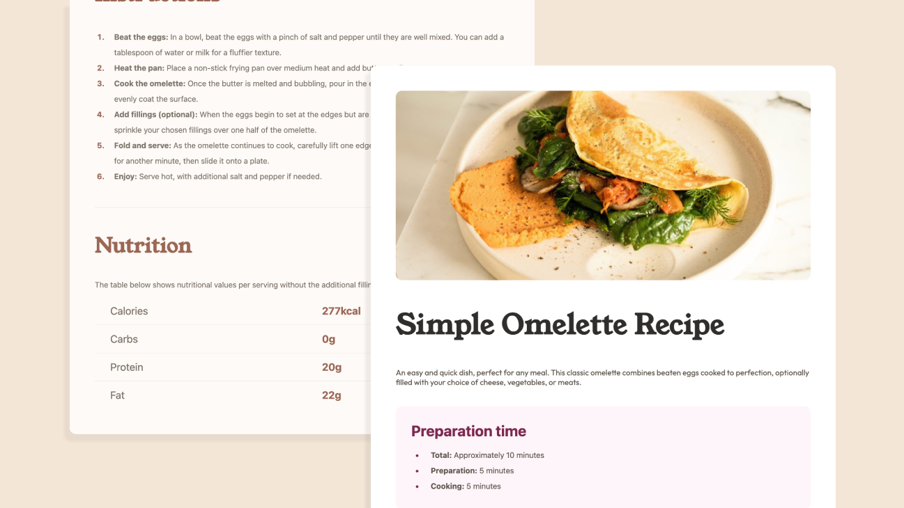

# Frontend Mentor - Recipe page

This is a solution to the [Recipe page challenge on Frontend Mentor](https://www.frontendmentor.io/challenges/recipe-page-KiTsR8QQKm). Frontend Mentor challenges help you improve your coding skills by building realistic projects. 

## Table of contents

- [Overview](#overview)
  - [Screenshot](#screenshot)
  - [Links](#links)
- [My process](#my-process)
  - [Built with](#built-with)
  - [Useful resources](#useful-resources)
  - [Before commit](#before-commit)
- [Author](#author)

## Overview

### Screenshot

> Screenshot of the solution

### Links

- Solution URL: [GitHub repo URL](https://github.com/FedericoMp/recipe)

## Dev process

### Built with

- Semantic HTML5 markup
- CSS custom properties

### Useful resources

- [Custom css properties](https://developer.mozilla.org/en-US/docs/Web/CSS/CSS_cascading_variables/Using_CSS_custom_properties) - Custom properties (CSS variables) that represent specific values to be reused throughout a document.

- [ARIA roles](https://developer.mozilla.org/en-US/docs/Web/Accessibility/ARIA/Reference/Roles) - ARIA roles provide semantic meaning to content and can be used to describe elements.

- [CSS analyzer](https://www.projectwallace.com/analyze-css) - Project Wallace is a set of CSS analyzers that check your complexity, specificity, performance.

- [Web Accessibility Testing](https://chromewebstore.google.com/detail/axe-devtools-web-accessib/) - Accessibility Checker for Developers, to find and fix more accessibility issues during website development.

- [HTML Compressor](https://htmlcompressor.com/compressor/) to compress markdown html build.

## Author

- Portfolio - [FedericoMp](https://federicomp.github.io/portfolio/)
- Frontend Mentor - [@FedericoMp](https://www.frontendmentor.io/profile/FedericoMp)